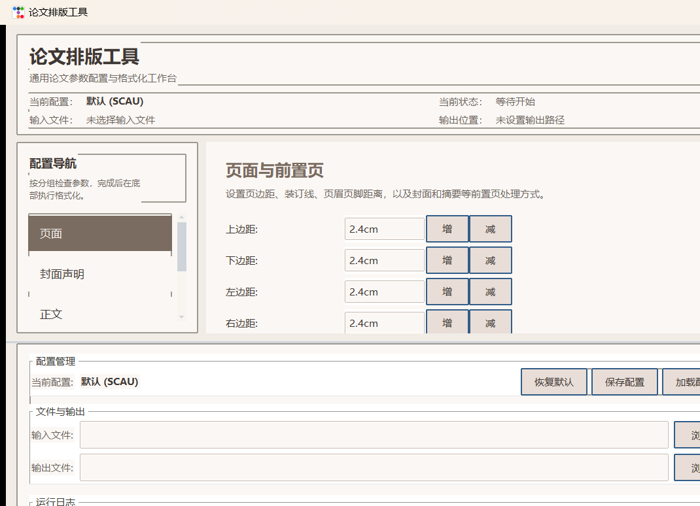

# 论文排版工具

面向通用论文场景的 Windows 桌面排版工具。默认内置 **华南农业大学 2024 本科毕业论文** 配置，也支持通过 YAML 配置适配其他学校。

当前版本已经从早期的单脚本工具演进为：
- 可视化桌面 GUI + CLI 双入口
- 模块化排版引擎 `thesis_formatter/`
- 覆盖题注模式、运行安全、前置页保留等场景的测试
- 更适合学生赶论文时快速核对参数、执行格式化和查看日志的桌面工作台



## 当前版本亮点

### 1. 更完整的论文格式化链路
- 支持 `.docx`、`.doc`、`.txt`、`.md`、`.tex` 输入，统一输出 `.docx`
- `.txt/.md/.tex` 可通过 Pandoc 转换进入统一排版流程
- `.doc` 可通过 Word COM 自动转为 `.docx`
- CLI 与 GUI 共用同一套核心格式化流水线，行为更一致

### 2. 更强的论文结构和版式控制
- 页面设置：页边距、装订线、页眉页脚距离
- 正文设置：字体、字号、行距、首行缩进、段前段后
- 标题设置：四级标题字体/字号/加粗/对齐/段距
- 页眉页码：前置页罗马数字、正文阿拉伯数字、奇偶页差异、首页不显示
- 图表题注：`stable` / `dynamic` 双模式、连续性检查、按章编号、续表识别
- 三线表参数：顶线、栏目线、底线粗细与表格行距
- 目录与参考文献：目录深度、字体、行距、参考文献悬挂缩进
- 封面与声明：支持自动生成、自定义封面、封面字段和声明页内容编辑
- 特殊标题映射：摘要、目录、参考文献、致谢等显示文本与对齐可配

### 3. GUI 已重构为更适合桌面效率工具的形态
- 固定使用稳定的 `sandstone` 主题，避免多主题下样式不一致
- 左侧配置导航可滚动
- 右侧主配置区可滚动，底部操作区常驻
- 运行日志区与主操作按钮位置更清晰
- 鼠标滚轮已做区域隔离，左侧导航和右侧内容区互不串滚

### 4. 配置与适配能力更强
- 根配置来自 `thesis_config.py` 的 SCAU 2024 默认值
- 支持加载/保存 YAML 配置，便于同校同学共享模板
- 题注、标题识别、特殊标题、封面字段等都可调
- 支持 `--dump-config` 导出默认配置骨架

### 5. 可靠性比旧版本更高
- 已加入 `tests/test_caption_modes.py` 与 `tests/test_runtime_safety.py`
- 对 `dynamic` 题注模式加入预检与自动降级逻辑
- 缺失 `numbering.xml`、前置页保留、运行时退出行为等有测试覆盖

## 主要优点

- 不是简单的“改几个字体”，而是把封面、摘要、目录、正文、题注、页眉页码、参考文献放进了一条统一流程
- 对毕业论文常见的“标题编号混乱、题注不规范、目录与正文不一致、参考文献缩进不对”这类高频问题有直接针对性
- GUI 和 CLI 都能用，适合日常点按操作，也适合打包成 exe 分发
- 默认配置可直接用于 SCAU 2024，本校同学上手成本低
- 模块化程度比旧版高，后续继续补学校模板、补测试、补规则更容易

## 根据当前代码判断的已知缺陷与限制

下面这些不是“理论上的可能”，而是从当前实现和测试能明确看出来的边界：

1. **Windows 依赖仍然很强**
   - `.doc` 转换依赖 Word COM
   - 目录更新依赖 Word COM
   - `dynamic` 题注模式最终更新域依赖 Word COM
   - 自定义封面插入依赖 `cscript` / VBS
   - 因此这个工具目前仍然是 Windows 优先方案

2. **非标准文档仍然可能识别失败**
   - 标题识别依赖样式、编号模式和正则
   - 题注识别依赖 `图1.1`、`表1.1`、`续表1.1` 等模式
   - 如果原稿标题、题注、前置页结构写法很随意，工具会降级、告警或跳过，不能保证全自动修正

3. **`dynamic` 题注模式不是对所有文档都稳**
   - 代码里已经为此加入预检和回退到 `stable` 的逻辑
   - 说明当前实现明确承认：并非所有输入文档都能安全启用动态题注域
   - 对于多级编号、章节样式不规范的论文，仍需人工核对图表编号和域结果

4. **图表位置问题目前偏“检测与告警”，不是完全自动修复**
   - 测试里明确检查了“表题位置异常”“续表编号未延续上一表”的告警
   - 这说明这部分目前更偏向发现问题，而不是完整自动纠正所有布局问题

5. **不同学校的封面、声明、摘要页要求仍需自己适配**
   - 默认配置深度绑定 SCAU 2024
   - 虽然已经支持 YAML、封面字段、声明页文本、自定义封面
   - 但如果学校规范差异很大，仍要自行调配置并人工复核

6. **富文档中的局部手工格式不一定能全部统一**
   - 当前引擎主要处理段落、标题、题注、页码、目录、主题字体等
   - 对图片内部文字、复杂表格局部布局、特殊文本框、手工拖拽对象等 Word 细节，不是全面版式引擎

7. **GUI 目前优先稳定而不是皮肤扩展**
   - 当前版本已锁定默认主题，避免切换主题后局部样式失真
   - 如果后续要恢复多主题，需要先把所有 ttk / tk 混合控件的样式补齐

结论很直接：这个工具已经足够实用，能显著减少论文排版里的重复劳动，但它仍然不是“完全不需要人工复核”的自动排版器。

## 适用场景

- SCAU 论文格式快速排版
- 已有 `.docx` 初稿，想统一标题、正文、页码、题注和目录
- `.txt/.md/.tex` 初稿，需要先转为 `.docx` 再套学校规范
- 同一学院/同一实验室共享一套 YAML 模板批量使用

## 快速开始

### 1. 安装依赖

```bash
pip install -r requirements.txt
```

当前依赖：
- `python-docx`
- `pyyaml`
- `pywin32`
- `ttkbootstrap`

### 2. 启动 GUI

```bash
python run_gui.py
```

### 3. 命令行使用

```bash
python thesis_format_cli.py --input 论文.docx
python thesis_format_cli.py --input 论文.docx --output 论文_规范版.docx
python thesis_format_cli.py --input 论文.docx --config thesis_config.yaml
python thesis_format_cli.py --dump-config
```

## 输入与依赖说明

| 输入格式 | 说明 | 额外依赖 |
|----------|------|----------|
| `.docx` | 直接进入格式化流程 | 无 |
| `.doc` | 先转 `.docx` | 需要 Microsoft Word |
| `.txt` | 预处理后经 Pandoc 转 `.docx` | 需要 Pandoc |
| `.md` | Pandoc 转 `.docx` | 需要 Pandoc |
| `.tex` | Pandoc 转 `.docx` | 需要 Pandoc |

## 项目结构

| 路径 | 说明 |
|------|------|
| `thesis_gui.py` | 桌面 GUI |
| `run_gui.py` | GUI 启动脚本 |
| `thesis_format_cli.py` | CLI / GUI 统一入口 |
| `thesis_runner.py` | 输入转换、格式化、后处理总流水线 |
| `thesis_config.py` | 默认配置与 YAML 加载 |
| `thesis_formatter/` | 模块化排版引擎 |
| `word_postprocess.py` | Word COM 后处理 |
| `defaults/scau_2024.yaml` | 默认学校配置 |
| `tests/` | 回归与运行安全测试 |

## 测试

```bash
python -m unittest discover -s tests
```

当前测试重点覆盖：
- 题注 `stable/dynamic` 模式
- 缺失 `numbering.xml` 时的容错
- 前置页跳过保留
- 运行时退出与安全行为

## 打包

项目内保留了 `build_exe.bat` 和 `thesis-format.spec`，可继续用于 Windows exe 打包。

## 许可证

GPL-3.0